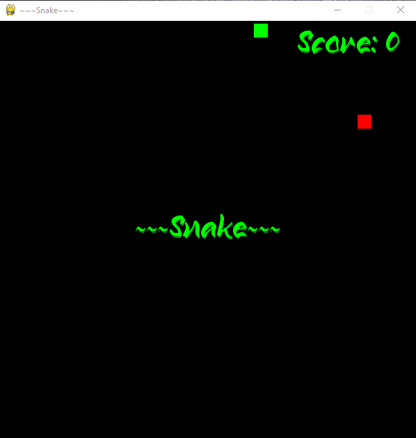

# snake_pygame
An OOP remake of the classic snake game using Pygame.

<div>
  
</div>


# Boot the game

There are only two dependencies - Pygame and Numpy - which you can install directly assuming you have Pipenv on your system by running:

```
pipenv install
```

Once the dependencies are installed, to start the game run:

```
pipenv run python snake.py
```

## Commands

Use the arrow keys on your keyboard to control movement. Note that you cannot turn on yourself, and remember to avoid the walls.

Change the FPS parameter if you wish to chang the speed of the game.

# Resources used

This game was adapted from https://github.com/marquesafonso/The-Art-of-Doing-Video-Game-Creation-With-Python-and-Pygame/tree/main/5_snake, the main changes consist of the OOP approach and the fact that we are restricting the snake's movement such that it is unable to turn on itself (i.e., if it is moving left it cannot move right). Other adaptations, namely, extra attributes and methods were included in the attempt to create a Learning Environment for a Deep Q Learning agent. This last part is still in development.
